<div align="center">

```
██╗   ██╗      █████╗ ██████╗ ██╗      ██████╗  █████╗ ███╗   ██╗██╗  ██╗
██║   ██║     ██╔══██╗██╔══██╗██║      ██╔══██╗██╔══██╗████╗  ██║██║ ██╔╝
██║   ██║     ███████║██████╔╝██║█████╗██████╔╝███████║██╔██╗ ██║█████╔╝ 
╚██╗ ██╔╝     ██╔══██║██╔═══╝ ██║╚════╝██╔══██╗██╔══██║██║╚██╗██║██╔═██╗ 
 ╚████╔╝      ██║  ██║██║     ██║      ██████╔╝██║  ██║██║ ╚████║██║  ██╗
  ╚═══╝       ╚═╝  ╚═╝╚═╝     ╚═╝      ╚═════╝ ╚═╝  ╚═╝╚═╝  ╚═══╝╚═╝  ╚═╝
                                                                           
         █████╗  ██████╗ █████╗ ██████╗ ███████╗███╗   ███╗██╗   ██╗      
        ██╔══██╗██╔════╝██╔══██╗██╔══██╗██╔════╝████╗ ████║╚██╗ ██╔╝      
        ███████║██║     ███████║██║  ██║█████╗  ██╔████╔██║ ╚████╔╝       
        ██╔══██║██║     ██╔══██║██║  ██║██╔══╝  ██║╚██╔╝██║  ╚██╔╝        
        ██║  ██║╚██████╗██║  ██║██████╔╝███████╗██║ ╚═╝ ██║   ██║         
        ╚═╝  ╚═╝ ╚═════╝╚═╝  ╚═╝╚═════╝ ╚══════╝╚═╝     ╚═╝   ╚═╝         
```

<p align="center">
  
  
  
  
</p>

<h2> Professional-Grade API Security Training Platform</h2>

**Master API vulnerabilities through hands-on exploitation in realistic banking applications.**  
Inspired by PortSwigger's Web Security Academy — now for the API world.

```diff
@ 10 Vulnerable Banking Applications × 10 Real-World API Flaws
+ Progressive Difficulty: From IDOR Chains to Multi-Stage Attacks
! Production-Like Infrastructure: Docker Orchestration & Microservices
```

</div>

---

##  **WHAT IS V-API-BANK ACADEMY?**

<table>
<tr>
<td width="50%" valign="top">

###  **The Academy**

A central learning platform where you:

```
┌──────────────────────────┐
│ ✓ Register & Track       │
│   Progress               │
│                          │
│ ✓ Unlock Labs            │
│   Progressively          │
│                          │
│ ✓ Submit Flags           │
│   & Get Validated        │
│                          │
│ ✓ Learn From             │
│   Detailed Solutions     │
└──────────────────────────┘
```

**Port**: `3000`  
**Tech**: Express.js + JWT Auth + JSON DB

</td>
<td width="50%" valign="top">

###  **The Labs**

10 isolated vulnerable applications:

```
┌──────────────────────────┐
│   Banking APIs          │
│   Payment Gateways      │
│   Vault Systems         │
│   E-Commerce Platforms  │
│   Analytics Services    │
│   Healthcare Portals    │
│   Crypto Exchanges      │
└──────────────────────────┘
```


</td>
</tr>
</table>

---

##  **ARCHITECTURE**

<div align="center">

```
╔════════════════════════════════════════════════════════════════════════╗
║                       V-API-BANK ACADEMY                               ║
╠═══════════════════════════╦════════════════════════════════════════════╣
║     ACADEMY WORLD         ║          LAB WORLD                       ║
║   (Control Plane)         ║        (Attack Surface)                    ║
║                           ║                                            ║
║   🌐 Port 3000            ║                                            ║
║                           ║                                            ║
║   ┌─────────────────┐     ║   ┌──────────┐  ┌──────────┐              ║
║   │   Academy UI    │     ║   │  Lab 01  │  │  Lab 02  │              ║
║   │   Dashboard     │────────▶│ NexaPay  │  │ FinVault │              ║
║   │   Progress      │     ║   │  Bank    │  │  Admin   │              ║
║   │   Tracker       │     ║   └──────────┘  └──────────┘              ║
║   └────────┬────────┘     ║                                            ║
║            │              ║   ┌──────────┐  ┌──────────┐              ║
║   ┌────────▼────────┐     ║   │  Lab 03  │  │  Lab 04  │              ║
║   │  Academy API    │     ║   │CloudPay  │  │SecureVlt │              ║
║   │  Express.js     │     ║   │ Wallet   │  │ Gateway  │              ║
║   │  + JWT Auth     │     ║   └──────────┘  └──────────┘              ║
║   └────────┬────────┘     ║                                            ║
║            │              ║   ┌──────────┐  ┌──────────┐              ║
║   ┌────────▼────────┐     ║   │  Lab 05  │  │  Lab 06  │              ║
║   │  JSON File DB   │     ║   │QuickXfer │  │ ShopAPI  │              ║
║   │  User Progress  │     ║   │ Payments │  │ Commerce │              ║
║   │  Lab Status     │     ║   └──────────┘  └──────────┘              ║
║   └─────────────────┘     ║                                            ║
║                           ║   ┌──────────┐  ┌──────────┐              ║
║                           ║   │  Lab 07  │  │  Lab 08  │              ║
║                           ║   │DataStrm  │  │ MediRec  │              ║
║                           ║   │Analytics │  │ Health   │              ║
║                           ║   └──────────┘  └──────────┘              ║
║                           ║                                            ║
║                           ║   ┌──────────┐  ┌──────────┐              ║
║                           ║   │  Lab 09  │  │  Lab 10  │              ║
║                           ║   │ DevHub   │  │CryptoTrd │              ║
║                           ║   │ GraphQL  │  │ Exchange │              ║
║                           ║   └──────────┘  └──────────┘              ║
╚═══════════════════════════╩════════════════════════════════════════════╝
```

</div>

---


## SCREENSHOTS


---

##  **QUICK START**

<table>
<tr>
<td width="50%">

###  **Deploy the Platform**

```bash
# Clone the repository
git clone https://github.com/cybersecuritylabs/vapi-bank
cd vapi-bank

# Launch all containers
docker-compose up --build

# Wait for services to initialize
# (~30 seconds)
```

</td>
<td width="50%">

### 🌐 **Access Points**

```plaintext
┌────────────────────────────┐
│ Academy Dashboard          │
│ → http://localhost:3000    │
└────────────────────────────┘

```

</td>
</tr>
</table>

---

## 🎓 **HOW TO LEARN**

<div align="center">



</div>

```mermaid
graph LR
    A[Register Account] --> B[Browse Labs]
    B --> C[Launch Lab 01]
    C --> D[Analyze Target]
    D --> E[Exploit Vulnerability]
    E --> F[Capture Flag]
    F --> G[Submit to Academy]
    G --> H[Unlock Next Lab]
    H --> I[Repeat & Level Up]
    
    style A fill:#00d4ff,stroke:#0099cc,color:#000
    style C fill:#ff6b35,stroke:#cc5529,color:#fff
    style E fill:#ff0055,stroke:#cc0044,color:#fff
    style F fill:#00ff88,stroke:#00cc6a,color:#000
    style H fill:#9d4edd,stroke:#7b3cb8,color:#fff
```

###  **The Learning Loop**

1. ** Register** on the Academy at `http://localhost:3000`
2. ** Browse Labs** — Start with Lab 01 (others locked initially)
3. ** Launch Lab** — Target application opens in new tab
4. ** Recon** — Explore the API using Burp Suite, Postman, or curl
5. ** Exploit** — Identify and exploit the vulnerability
6. ** Find Flag** — Hidden somewhere in the compromised system
7. ** Submit** — Paste the flag back in the Academy dashboard
8. ** Progress** — Unlock the next lab and continue your journey

---

##  **LAB CATALOG**

<table>
<thead>
<tr>
<th width="5%">Lab</th>
<th width="20%">Name</th>
<th width="20%">Target Application</th>
<th width="30%">Vulnerability Class</th>
<th width="15%">Difficulty</th>
</tr>
</thead>
<tbody>

<tr>
<td align="center"><b>01</b></td>
<td><b>Chained IDOR</b></td>
<td>NexaPay Digital Bank</td>
<td>IDOR Chain → Account Takeover</td>
<td></td>
</tr>

<tr>
<td align="center"><b>02</b></td>
<td><b>Broken Function Auth</b></td>
<td>FinVault Admin Portal</td>
<td>Missing Function-Level Access Control</td>
<td></td>
</tr>

<tr>
<td align="center"><b>03</b></td>
<td><b>Mass Assignment</b></td>
<td>CloudPay Wallet</td>
<td>Hidden Nested Property Injection</td>
<td></td>
</tr>

<tr>
<td align="center"><b>04</b></td>
<td><b>JWT Secret Forgery</b></td>
<td>SecureVault API Gateway</td>
<td>Weak JWT Signing Secret (Bruteforce)</td>
<td></td>
</tr>

<tr>
<td align="center"><b>05</b></td>
<td><b>Race Condition</b></td>
<td>QuickTransfer Payments</td>
<td>Double-Spend via Race Condition</td>
<td></td>
</tr>

<tr>
<td align="center"><b>06</b></td>
<td><b>Business Logic Flaw</b></td>
<td>ShopAPI E-Commerce</td>
<td>Price Manipulation Attack</td>
<td></td>
</tr>

<tr>
<td align="center"><b>07</b></td>
<td><b>API Key Leak</b></td>
<td>DataStream Analytics</td>
<td>Leaked Credentials in HTTP Headers</td>
<td></td>
</tr>

<tr>
<td align="center"><b>08</b></td>
<td><b>Predictable Reset Token</b></td>
<td>MediRecord Health Portal</td>
<td>Weak Token Generation Algorithm</td>
<td></td>
</tr>

<tr>
<td align="center"><b>09</b></td>
<td><b>GraphQL Auth Bypass</b></td>
<td>DevHub Platform</td>
<td>Introspection + Broken Authorization</td>
<td></td>
</tr>

<tr>
<td align="center"><b>10</b></td>
<td><b>Multi-Step Chain</b></td>
<td>CryptoTrade Exchange</td>
<td>SSRF + Info Disclosure + Auth Bypass</td>
<td></td>
</tr>

</tbody>
</table>

---

## 🛠️ **TECH STACK**

<table>
<tr>
<td width="33%" align="center" valign="top">

### 🎓 **Academy Platform**

```
┌─────────────────┐
│   Node.js       │
│   Express.js    │
│   JWT Auth      │
│   JSON File DB  │
│   Vanilla JS    │
└─────────────────┘
```

Clean, simple, no bloat.  
Focus on security, not frameworks.

</td>
<td width="33%" align="center" valign="top">

### ⚔️ **Lab Applications**

```
┌─────────────────┐
│  Express.js     │
│  REST APIs      │
│  GraphQL        │
│  JWT/Sessions   │
│  SQLite/JSON    │
└─────────────────┘
```

Each lab = isolated microservice.  
Real-world API patterns.

</td>
<td width="33%" align="center" valign="top">

### 🐳 **Infrastructure**

```
┌─────────────────┐
│   Docker        │
│   Compose       │
│   Multi-Stage   │
│   Networking    │
│   Volumes       │
└─────────────────┘
```

Production-like deployment.  
One command to rule them all.

</td>
</tr>
</table>

---

## 🎖️ **SKILL PROGRESSION**

<div align="center">

| Level | Labs Completed | Skills Unlocked |
|-------|----------------|-----------------|
|  **Novice** | 0-2 | Basic IDOR, Auth Bypass |
|  **Apprentice** | 3-5 | Mass Assignment, JWT Attacks |
|  **Practitioner** | 6-8 | Race Conditions, Business Logic |
|  **Expert** | 9-10 | GraphQL, Multi-Stage Chains |

</div>

---

##  **LEARNING RESOURCES**

<table>
<tr>
<td width="50%">

###  **Recommended Tools**

- **Burp Suite Community/Pro** — HTTP interception
- **Postman** — API testing & collection building
- **curl/httpie** — Command-line HTTP clients
- **JWT.io** — JWT token analysis
- **SQLMap** — SQL injection (if needed)
- **GraphQL Playground** — GraphQL exploration

</td>
<td width="50%">

###  **Study Materials**

- OWASP API Security Top 10
- PortSwigger Web Security Academy
- HackTricks API Pentesting Guide
- PentesterLab API Security Exercises
- Bug Bounty Bootcamp (Ch. 22-23)
- Real-World Bug Bounty Hunting

</td>
</tr>
</table>

---

## ⚠️ **DISCLAIMER**

<div align="center">

```
╔═══════════════════════════════════════════════════════════════╗
║                                                               ║
║  ⚠️  EDUCATIONAL USE ONLY                                     ║
║                                                               ║
║  This platform contains intentionally vulnerable code.       ║
║  Do NOT deploy on public networks or production systems.     ║
║                                                               ║
║  Use in isolated lab environments ONLY.                      ║
║  Unauthorized testing on live systems is illegal.            ║
║                                                               ║
╚═══════════════════════════════════════════════════════════════╝
```

</div>

---

## 🤝 **CONTRIBUTING**

We welcome contributions that improve the learning experience:

✅ **Accepted:**
- New lab scenarios
- Documentation improvements
- Bug fixes in infrastructure
- UX/UI enhancements
- Translation/localization

❌ **Not Accepted:**
- Solution walkthroughs in main repo
- Removal of intentional vulnerabilities
- "Security fixes" for lab applications (they're supposed to be vulnerable!)

---

## 📜 **LICENSE**

```
MIT License — Educational and Training Purposes Only

This software is provided for security education and professional
development. By using this platform, you acknowledge that:

1. You will not deploy it on public-facing infrastructure
2. You will only test against your own isolated lab environment
3. You understand the legal implications of unauthorized testing
4. You will use learned techniques ethically and responsibly
```

---

<div align="center">

##  **READY TO BEGIN?**

```
┌──────────────────────────────────────────────────┐
│                                                  │
│   10 Labs. 10 Vulnerabilities. Infinite Growth.│
│                                                  │
│  Start your API security mastery journey today.  │
│                                                  │
│  ▶ docker-compose up --build                     │
│  ▶ open http://localhost:3000                    │
│                                                  │
│  Your first flag awaits in NexaPay Digital Bank. │
│                                                  │
└──────────────────────────────────────────────────┘
```

<br>

**🏦 WELCOME TO V-API-BANK ACADEMY 🏦**

<br>

---

<sub>Built with 💙 by Cyberlabs | Star ⭐ this repo if it helps you level up</sub>

</div>
